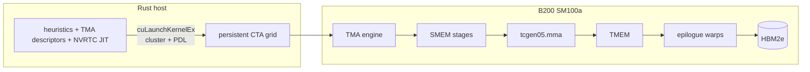
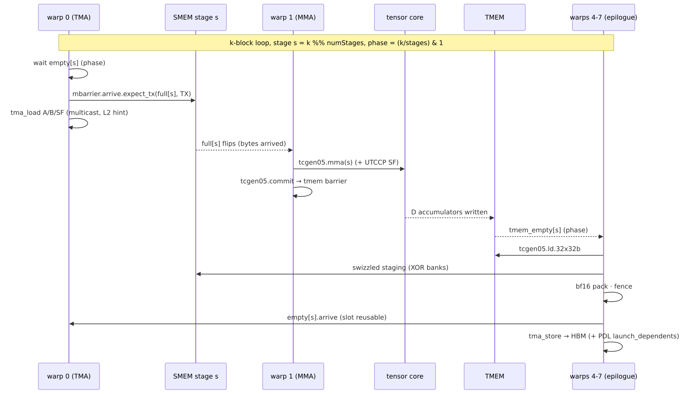

# Concepts & Architecture — DeepGEMM-RS on Blackwell

This guide explains every concept the kernels rely on, with diagrams.
The same explanations appear (in condensed form) as comments in the sources:

| Topic | Code location |
|---|---|
| Hardware model, PTX helpers | `deepgemm/kernels/prelude.h` (top banner) |
| GEMM pipeline & barriers | `deepgemm/kernels/gemm_sm100.cu` (top banner) |
| MQA logits warp map | `deepgemm/kernels/mqa_logits_sm100.cu` (top banner) |
| SF packing & quantization | `deepgemm/kernels/layout_quant.cu` (top banner) |
| Bit-exact CPU model | `deepgemm/src/golden.rs` |
| TMA descriptors | `deepgemm/src/tma.rs` (module docs) |

Rendered diagrams: [`img/`](img/) (regenerate with
`python3 scripts/gen_diagrams.py` from the repo root — sources in
[`diagrams-src/`](diagrams-src/)).

---

## 1. The big picture

One GEMM call is a *co-program* between the Rust host and a set of
asynchronous engines on the GPU:





* **Host side** (`deepgemm` crate): `heuristics.rs` picks the tile
  shape/cluster/stages, `tma.rs` encodes the copy programs
  (`cuTensorMapEncodeTiled`), `jit.rs` compiles the kernel *for that exact
  configuration* with NVRTC (DeepGEMM's DeepJIT model — no offline toolkit,
  no cubin files), and `sys.rs` launches with cluster dims and programmatic
  dependent launch.
* **Device side**: no CUDA-core arithmetic in the main loop — data moves
  HBM→SMEM (TMA), SMEM→TMEM (tensor core), TMEM→registers (`tcgen05.ld`),
  registers→HBM (TMA store). Everything else is scheduling.

## 2. tcgen05 — the tensor core is an asynchronous engine

On Hopper (SM90) the MMA was issued by *threads* (WGMMA). On Blackwell
(SM100) the tensor core is a **separate engine with its own memory**:

* **TMEM** — 512 columns × 128 lanes × 32-bit per SM, writable *only* by the
  tensor core. The MMA writes accumulators there; a separate SF path writes
  per-block scales. `tcgen05.alloc` claims columns, `tcgen05.ld` moves data
  to registers, `tcgen05.commit` publishes completion to an mbarrier.



Key trick used by DeepGEMM: when SF columns push the total past 512, the
SF region *aliases* accumulator columns (col j ≡ j−512); the pipeline is
arranged so the two uses never overlap in time.

## 3. The GEMM pipeline

The kernel is warp-specialized; each warp class owns one engine:



Per k-block (stage `s = k % numStages`, phase `= (k/stages) & 1`):

```text
k:      0        1        2        3        4        5     ...
       ┌────────┬────────┬────────┬────────┬────────┬────────┐
TMA(w0):│load s0 │load s1 │load s2 │load s3 │  ...   │        │ A/B/SF tiles,
       └────────┴────────┴────────┴────────┴────────┴────────┘ L2 cache-hint
MMA(w1):         │mma s0  │mma s1  │mma s2  │  ...   │        │ leader CTA in
       └────────┴────────┴────────┴────────┴────────┴────────┘ 2-CTA mode
EPI(w4-7):                │drain s0│drain s1│  ...   │        │ TMEM→SMEM→TMA
       └────────────────────────────────────────────────────────┘ store
```

Barrier topology per stage: `full[s]` (TMA byte-count → MMA+SF warps),
`empty[s]` (epilogue drained the slot → producer may overwrite),
`tmem_empty` (accumulators consumed → next MMA may write).
All waits are `mbarrier.try_wait.parity` spins — one bit per stage slot,
phases alternate 0/1, so N-stage buffering costs N barriers, not a queue.

## 4. Warp specialization & register economics



* warp 0 — TMA producer (`elect_one_sync` + descriptor args by value)
* warp 1 — MMA issuer; in 2-CTA clusters only the **leader** CTA issues, and
  the per-stage descriptor table is shared through the buddy via `shfl`
* warps 2–3 — SF transposers: rearrange SF bytes in SMEM so
  `tcgen05.cp.32x128b.warpx4` (UTCCP) lands them in the right TMEM lanes
* warps 4–7 — epilogue: `tcgen05.ld.32x32b` → XOR-swizzled SMEM staging →
  `tma_store` (bf16 packed on the way; `fence.proxy.async` before the store)

`setmaxnreg.dec/inc` (56 ↔ 224 registers) lets specialized warps donate
their register budget to the math path — free occupancy.

**swap-AB**: m-grouped GEMMs compute `(BᵀA)ᵀ`, exchanging operand roles so
tiny per-expert M still fills UMMA_M=128 tiles; the epilogue then reads TMEM
in `16x256b` shape and STSMs the SMEM transposed.

## 5. Numeric formats & block scaling



```text
E4M3 (FP8)  s eeee mmm   bias 7 · max 448 · subnormals 2^-9 steps
E2M1 (FP4)  s ee m       bias 1 · grid {0, .5, 1, 1.5, 2, 3, 4, 6}
UE8M0 (SF)  8-bit pure exponent · value = 2^(code−127) · code 0 reserved
```

The MMA hardware (`kind::mxf4` for packed FP4 with BLOCK_K=256;
`kind::mxf8f6f4` for FP8/BF16) multiplies the **linear codes**; the
power-of-two scales ride a parallel path:

```text
D_i,j = Σ_k  codeA_i,k · codeB_j,k · 2^(sfA_i,k/g − 127) · 2^(sfB_j,k/g − 127)
                          g = 32 (OCP MX) or 128 (DeepSeek FP8 recipe)
```

**SF packing** — one int32 holds four consecutive-K scales for one row:

```text
word(k/4, m) = UE8M0(k+0) | UE8M0(k+1)<<8 | UE8M0(k+2)<<16 | UE8M0(k+3)<<24
               where UE8M0(x) = bits 23..30 of the f32 scale (a power of two)

layout: [ceil(sf_k/4), align(mn,4)] — MN-contiguous, so a 16-byte TMA row
        carries 4 consecutive rows of the same k group.
```

`transform_sf` (layout transform) and `quant_mx` (activation quantization)
emit **bit-identical** buffers for the same scales — asserted on GPU by
`tests/e2e_gpu.rs::transform_sf_bit_exact_vs_golden` against the CPU model.

Quantization: per `gran`-element group,
`amax → 2^exp` via the upstream bit-trick
`(bits(amax) + 0x7FFFFF − kQuantMaxMantissa) >> 23` — the `+0x7FFFFF`
rounds amax **up** to the next power of two when its fraction exceeds 0.5
(`amax=7 → 8 → scale 2`; `amax=500 → 512 → scale 2`), then each element is
RNE'd onto the target grid. Floors: FP8 exp 105 (`amax ≥ 1e-4`), FP4 exp 1.

## 6. Persistent scheduling & L2 swizzle

The grid is fixed at `num_SMs` blocks; each CTA loops over output tiles in
groups of `kNum1DBlocksPerGroup` (8 or 16, chosen to minimize
`Σ tiles · BLOCK_N + waves · BLOCK_M`). Concurrent CTAs in a group share an
A-row band → their TMA A-loads hit L2 once; B tiles are *multicast* to both
cluster CTAs. PDL (`griddepcontrol.wait` / `launch_dependents`) overlaps the
next kernel's prologue with this one's epilogue.

## 7. MQA logits (MLA lightning indexer)

`logits[i, j] = Σ_h w[i,h] · relu(⟨q[i,h,:], kv[j,:]⟩)` — computed by the
same engine trio, but with **four** warp classes (see the banner of
`mqa_logits_sm100.cu`): KV producer, SF/weights producer, SF transposer+UTCCP,
MMA issuer, plus two math warpgroups that drain TMEM, apply the weighted ReLU
in bf16x2 FMA, and scatter-store each token's span into global.

## 8. Two-plane validation — "run it in this sandbox through anyway"



The same kernels and the same numeric model are checked on two planes:

* **No-GPU plane** (this sandbox, CI, any laptop):
  `deepgemm-bench compile-check` — NVRTC is a pure compiler, so the full
  kernel suite is validated offline to **PTX** (`compute_100a`, the exact
  runtime path) *and* **SASS** (`sm_100a`, via `nvrtcGetCUBIN`'s ptxas
  backend). This mode caught six real bugs that would have failed the first
  `smoke` on a B200.
  Plus `cargo test` — 18 CPU tests of the bit-exact golden model
  (`src/golden.rs`): format round-trips, SF packing, upstream amax→scale
  formulas, block-scaled GEMM, MQA logits.
* **B200 plane**: `smoke` (JIT on device), `cargo test --features e2e`
  (GPU vs golden, including the bit-exact `transform_sf` cross-check), and
  `bench` for TFLOPS.
